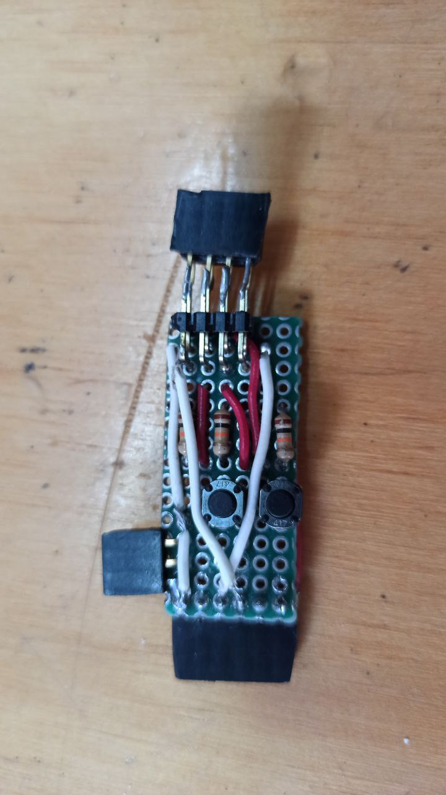
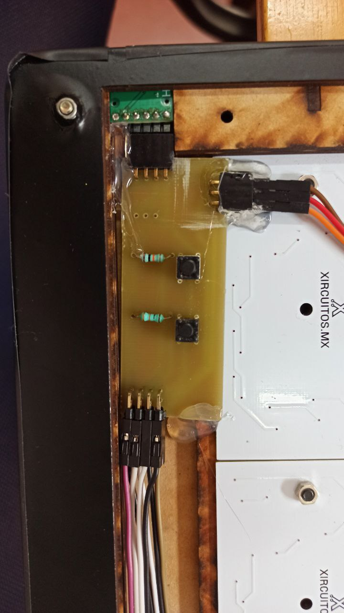

# NeoClock - Internet Clock, Weather & IoT Panel

NeoClock is a clock connected to the Internet, that in addition to show time and date,
can be configured to show other data, as weather and messages sent from a remote device
whithout extra hardware.  

It's build with 4 NeoDigitos.  

- **pics** - photos and diagrams
- **eagle** - test pcb design for ESP-01
- **cad** - 3D model and drawings for laser cut

Archivos de esquematico y placa en Eagle para el diseño de pcb,
para poder alimentar y reprogramar ESP 01 sin necesidad de extraer la tapa.

El circuito consta de un convertidor de micro USB a serial, un ESP 01, 2 botones y pines machos y hembras,
es importante tomar en cuenta el diseño del display para el orden y dimenciones del circuito

La primera versión consta de una placa perforada para circuito, sin embargo el tamaño tan ancho no permitia
que este se pudiera cerrar.

La segunda versión fue rediseñada en Eagle para realizarse en router para pcb de esta manera se puede ahorrar espacio,
lo que nos permite que el display no sea tan ancho, dando como resultado un diseño mas compacto.

