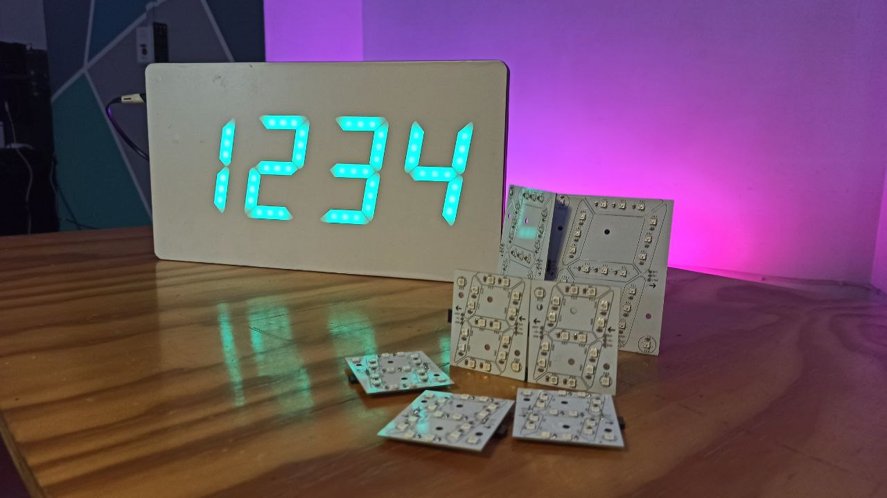

# NeoDisplay
This repository is a colection of displays made with NeoDigitos.  
The NeoDigito library for Arduino is [here](https://github.com/Inventoteca/NeoDigito)

## NeoClock - Internet Clock, Weather & IoT Panel
NeoClock is a clock connected to the Internet, that in addition to show time and date,
can be configured to show other data, as weather and messages sent from a remote
device whithout extra hardware.  

It's build with 4 NeoDigitos.  

## Single Digit
This display uses one single digit  

